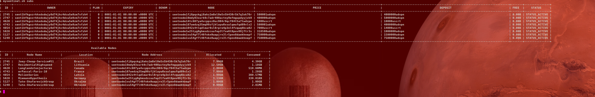

# mysentinel
An easy to use wrapper around the sentinelcli. 

## Install
Get and install **sentinel-cli**


## Configure

Git and install **MySentinel**

```shell
git clone https://github.com/freqnik/mysentinel
```

Copy **mysentinel.sh** to `$HOME/bin` and make sure `$PATH=$HOME/bin:$PATH` is in your **.bashrc** file.

Run:
```shell
mysentinel.sh help
```

And follow the prompts to add your wallet address and wallet name. If your wallet isn't installed use
```shell
mysentinel.sh recover
```

This will add your wallet to the **sentinel-cli** config. 


## Usage
MySentinel now understands using the SCRT token on the Sentinel Network. 

An example to subscribe to a SCRT DVPN node would be

```shell
$mysentinel.sh sub sentnode1042x4tlqdlmar0sl0rpre4p3nl4fvqwq6kca02 7000uscrt

mysentinel.sh sub sentnode1042x4tlqdlmar0sl0rpre4p3nl4fvqwq6kca02 7000uscrt
Total SCRT: 7000ibc/31FEE1A2A9F9C01113F90BD0BBCCE8FD6BBB8585FAF109A2101827DD1D5B95B8
NODE: sentnode1042x4tlqdlmar0sl0rpre4p3nl4fvqwq6kca02, DEPOSIT: 7000ibc/31FEE1A2A9F9C01113F90BD0BBCCE8FD6BBB8585FAF109A2101827DD1D5B95B8
Confrim (y/n): 
```


```shell
$ mysentinel.sh help

         MySentinel dVPN v0.3.3 (freQniK)
        
         Usage: /home/bubonic/bin/mysentinel.sh [options]
          
         Options: 
                  list,                         list all available dVPN nodes
                  sub <NODE_ADDRESS> <DEPOSIT>, subscribe to a node with address and deposit amount (in udpvn or uscrt, i.e., 500000udpvn, 7000uscrt)
                  subs,                         list your subscriptions with extra output of Location and Node Name
                  quota <ID>,                   list the quota and data used for subscription ID (found in subs option)
                  conn <ID> <NODE_ADDRESS>,     connect to the Node with ID and NODE_ADDRESS
                  part,                         disconnect from Sentinel dVPN. Note: you may have to ifconfig down <wg_interface> and edit /etc/resolv.conf
                  recover,                      add a wallet from the seed phrase
          
$ 

```

Example output:

```shell
mysentinel.sh subs
```



In case I want to connect to a node I would run:

```
$ ./mysentinel.sh conn 1329 sentnode1cwrk3xev08e75afd75y8ckqvt4ks4wq7g770v8
```

To disconnect:
```
$ ./mysentinel.sh part
```

**NOTE:** I've experienced the follwing issues when using the sentinelcli to disconnect. It never brings down the wireguard interface. In my case after `mysentinel.sh part` I would then run `sudo ifconfig wg_interface down`. Furthermore, my `/etc/resolv.conf` is not set to my gateway, as I run a dnsproxy there. So you may have to edit `/etc/resolv.conf` as well back to the original settings.

# Tipjar
You tip a waiter for their service, why not tip a programmer for their code?


```
DVPN: sent14q4f245fj25xy57yhjah98jcvy6e3zndx76fh4
```

